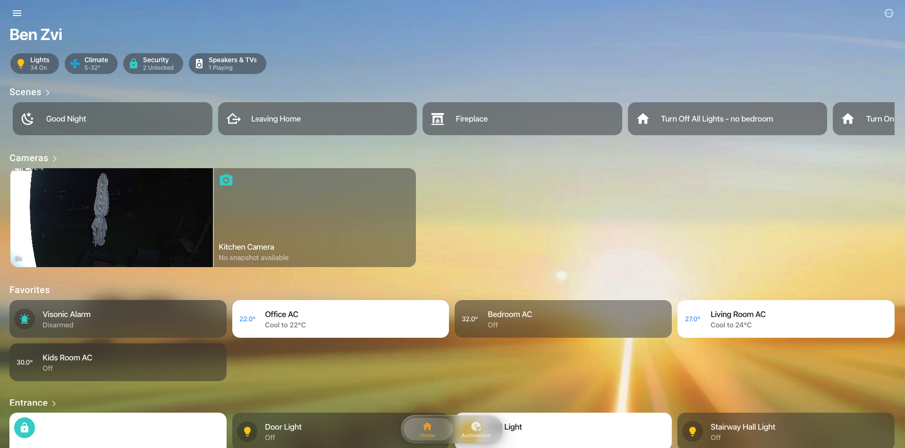

# 🏠 Apple Home Dashboard Strategy

[](https://github.com/hacs/integration)


A pixel-perfect, high-performance Apple Home Experience for Home Assistant. This strategy instantly transforms your Lovelace dashboard into a native iOS Home app – with automatic categorization, smart iPad modes, and a premium "Liquid Glass" design system.



---

## 🔥 Why Apple Home Dashboard?

- **Automatic Architecture**: No more manual YAML cards. The strategy discovers your Areas, Entities, and Domains to build a perfectly structured dashboard in seconds.
- **True Apple Parity**: Mirrors the original app's grouping (Lights, Climate, Security, Media) and context-aware naming.
- **Native iPad Mode**: A dedicated, sidebar-driven interface for tablets that feels indistinguishable from iPadOS.
- **Liquid Glass Design**: Modern aesthetics with frosted blurs, smooth spring animations, and a high-end interaction feel.
- **Zero-Latency**: Optimized to run at 60+ FPS even on older tablets by leveraging GPU hardware acceleration.

---

## 🚀 Installation

### Option 1: HACS (Recommended)
1. Open **HACS** in Home Assistant.
2. Go to **Frontend**.
3. Click the three dots in the top right and select **Custom repositories**.
4. Paste the URL of this repository: `https://github.com/nitaybz/apple-home-dashboard`
5. Select **Lovelace** (Dashboard) as the category and click **Add**.
6. Find "Apple Home Dashboard Strategy" and click **Download**.

### Option 2: Manual
1. Download the `apple-home-dashboard.js` from the latest release.
2. Copy it to your Home Assistant `/config/www/` folder.
3. Add a Lovelace resource:
   - URL: `/local/apple-home-dashboard.js`
   - Type: `module`

---

## 🛠 Setup in 3 Steps

1. Create a **new Dashboard** (Settings → Dashboards → +).
2. Give it a title and path (e.g., `apple-home`).
3. Open the **Raw Configuration Editor** (three dots in top right) and paste:

```yaml
strategy:
  type: custom:apple-home-strategy
views: []
```

**That's it!** Your dashboard will instantly populate with your rooms, scenes, and cameras.

---

## ✨ Features at a Glance

### 📱 Adaptive Interface
- **Mobile Optimized**: Centralized layouts with easy thumb reach.
- **iPad Pro Mode**: Floating sidebar, multi-column grids, and dynamic layout shifting.
- **Desktop Ready**: Liquid-glass design that scales to high-res monitors.

### 🧠 Smart Behavior
- **Room Pages**: Automatically creates one page per HA Area.
- **Smart Grouping**: Intelligent filters for Lighting, Climate, Security, and Media.
- **Context Naming**: Cleans up redundant names (e.g., "Living Room Lamp" becomes just "Lamp" on the Living Room page).
- **Auto-Favorites**: Leverages your HA favorites or lets you define custom ones.

### 🎨 Premium Aesthetics
- **Liquid Glass Components**: Circular buttons with real-time translucency.
- **Spring Animations**: Native-feeling scale effects on tap (`transform: scale(0.96)`).
- **Dynamic Backgrounds**: Choose between Apple presets or custom image backdrops directly in the dashboard settings.

---

## ✏️ Native Customization

You don't need YAML to change your layout. Enter **Edit Mode** directly in the dashboard to:
- **Drag & Drop**: Reorder accessories, rooms, or entire sections.
- **Favorites**: Mark any device as a favorite with one tap.
- **Card Sizing**: Toggle between **Tall** and **Regular** layouts for Thermostats, Locks, and Alarms.
- **Visibility**: Hide entire rooms or sections from the home view.

---

## 📄 License
This project is licensed under the **MIT License**. See the `LICENSE` file for details.

---

## 🙌 Credits & Support
Developed with ❤️ by the Apple Home Dashboard Team.

If you love this dashboard and want to support continued development:
- [Patreon](https://patreon.com/nitaybz)
- [Ko-fi](https://ko-fi.com/nitaybz)
- [PayPal](https://paypal.me/nitaybz)

*"Bringing the best of Apple Design to the power of Home Assistant."*
